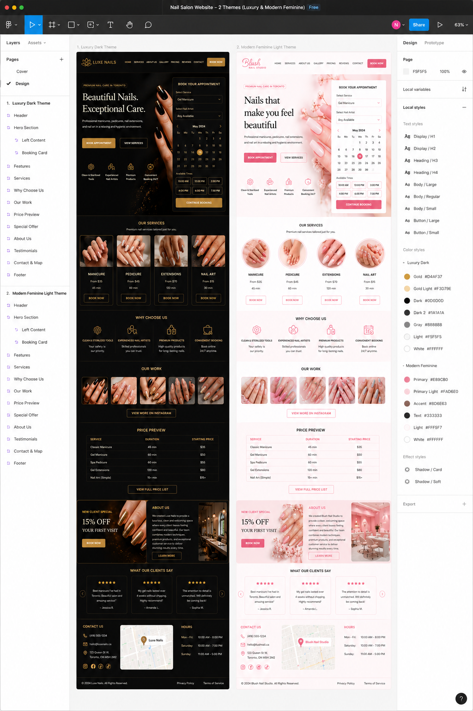

# Project Mission & Vision: Maiia Nails Booking Platform

## 🌟 Vision Statement
To establish a premium, visually striking, and seamless digital gateway for a modern boutique nail salon. The platform bridges the gap between creative visual artistry and precise business orchestration, enabling customers to discover custom nail designs and book tailored treatments instantly with zero friction.

## 🎯 Core Mission
To engineer a performant, resilient, and highly accessible multi-step booking engine paired with a dynamic design portfolio. The codebase must prioritize strict data integrity, preventing runtime appointment scheduling conflicts while offering an inclusive user interface accessible to all individuals.

## Design scetches
In the attached image implemented desirable design, color schema for dark and light themes, use it for building UI/UX

## 🗺️ Long-Term Technical Roadmap

### 📦 Milestone 1: Structural Foundations (Complete)
- [x] Configure Next.js corporate workspace structure.
- [x] Establish isolated offline database layer using Dockerized PostgreSQL.
- [x] Integrate Prisma 7 architectural layout with customized client compilation engines and TCP driver adapters.

### 📅 Milestone 2: Dynamic Scheduling API (Current Focus)
- Implement algorithmic calendar workflows to parse working shifts, employee intervals, and dynamic service block durations.
- Enforce relational schema isolation to guarantee transaction safety across concurrent booking actions.

### 🎨 Milestone 3: Semantic Interface & Portfolio Front
- Build a responsive, fluid layout for services and visual nail portfolios.
- Construct the multi-step booking wizard with native state validation and complete keyboard accessibility overrides.

### 📊 Milestone 4: Administration Dashboard & Deployment Pipelines
- Deploy persistent storage layers onto Azure Database for PostgreSQL Flexible Servers via student programs.
- Link Vercel Serverless automated CI/CD triggers to production branches.
- Build an authenticated management portal for salon operators to lock time-off windows or track internal operations.